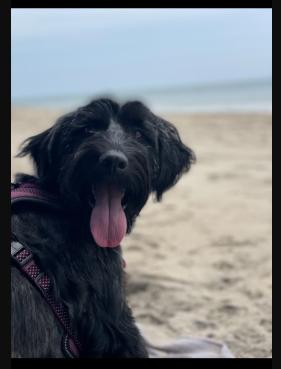

<h1 align=center>My First NFT</h1>

- Link to GitHub repository: https://github.com/Tzcodes101/myFirstNFT
- Link to active NFT: https://gateway.pinata.cloud/ipfs/QmchxjMg4Bw6APPR1mKBmES73rcrV87fV5UDHgWKjRSW6z

## Description
My first NFT is the first project I completed with Solidity. The NFT features my dog, Arwin. I followed a series of tutorials to create and deploy an ERC-721 smart contract on the Ropsten test network using Metamask, Solidity, Hardhat, Pinata and Alchemy. The tutorials can be found here:

https://docs.alchemy.com/alchemy/tutorials/how-to-create-an-nft

- User Story: I want to mint NFTs so that I can determine ownership of digital assets.

## Table of Contents
- [Description](#Description)
- [Installation](#Installation)
- [License](#License)
- [FutureDevelopment](#FutureDevelopment)
- [Contributors](#Contributors)
- [Testing](#Testing)
- [Questions](#Questions)

## Installation
This project requires no installation.

## License

This project is covered by the ISC license.

## Future Development
- The ability to sell this NFT.

## Contributors
- Talia Zisman

## Questions
Please contact the contributors of this application with any questions.
- Talia Zisman
    - Email: tzcodes101@gmail.com
    - GitHub: [tzcodes101](http://github.com/tzcodes101)